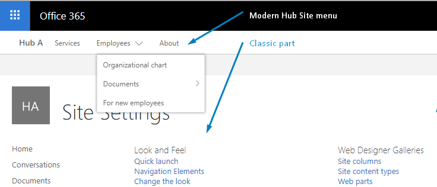
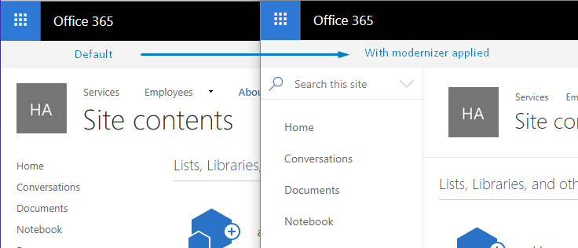

# SharePoint Online classic sites modernizer kit

**SharePoint Modernizer Kit** is an expandable set of solutions for Classic SharePoint which help in the transition to Modern experience.

> _This is a draft version and some work is in progress_

## Solutions

### Hub site menu

Adds modern hub site menu to classic sections of modern sites connected to a Hub Site including classic subwebs.



### Modernizer theme

Transforms classic Seattle master page look and feel to the modern experience.



### ... ideas and commits are welcomed

## Installation

### Prerequisites

- SharePoint Online
- Node.js, NPM
- Git client

### Clone the project

```bash
git clone https://github.com/koltyakov/sp-modernizer-kit
```

### Restore dependencies

`cd` to the project folder and:

```bash
npm install
```

### Connect to SharePoint

```bash
npm run config
```

Then provide SharePoint hub site URL and credentials in wizard prompts.

### Build the project

```bash
npm run build
```

Compiles project to `./dist` folder.

### Scripts deployment

```bash
npm run publish && gulp custom-actions
```

Publishes `./dist` folder content to SharePoint assets folder. Installs custom actions.

> **Note**: By default, modern sites have `DenyAddAndCustomizePages` site property set to `true`. This means that no custom scripts can be uploaded even with admin creds.

`DenyAddAndCustomizePages` should be temporary disabled, i.e. using PowerShell:

```powershell
Set-SPOSite -Identity https://{tenant}.sharepoint.com/sites/{site_uri} -DenyAddAndCustomizePages $False
```

or [Office365 CLI](https://github.com/pnp/office365-cli):

```bash
spo site classic set --url https://{tenant}.sharepoint.com/{site_uri} --noScriptSite false
```

### Custom actions provisioning to all sites connected to the hub

#### TBD

- Detect all sites in a hub
- Add custom task for ScriptLink custom actions provisioning
